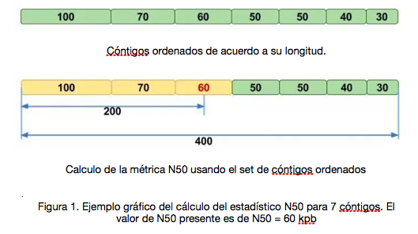

21 de mayo, 2019

### Marco Antonio Alan Garduño Sánchez.
## Tarea 9.1. 

**Discute en qué consiste la métrica de control de calidad de ensamblado de genomas completos "N50" y cómo interpretarla. Incluye ejemplos.**

  El estadístico N50 es una medida que describe la calidad del ensamble de un genoma, formado a partir de fragmentos conocidos como cóntigos (contigs; Fragmentos de DNA contiguos de diferente longitud). Dado un número de cóntigos, el estadítico N50 se define como el tamaño del cóntigo más pequeño de un set de cóntigos que cubren el 50% del genoma.  

**Ejemplo**.

  Durante un ensamble, los reads apilados formaron 7 diferentes cóngitos: con_1 = 100kb, con_2=70 kb, con_3= 60 kb (…) con_7=30 kb, formando una representación genómica de 400 kb en total.  El 50% de dicha representación es de 200%. Considerando el conjunto de cóntigos más grandes, el de menor tamaño es el cóntigo cont_3 = 60 kb (fig. 1)

**Lee la documentación de stacks e ipyrad y los artículos mencionados en clase para la estandarización de parámetros. Escoge uno de los dos programas y discute ¿cuáles son los parámetros más sensibles, con qué estrategia los optimizarías y en qué rango de valores los variarías? Haz un reporte en markdown que incluya Introducción, Discusión y un ejemplo de scripts de los pasos de la pipeline donde variarías los parámetros. Guarda el reporte en tu su repositorio e indica el link en el espacio de abajo.**

---

# El espacio de parámetros en Stacks.
### Introducción.

  En la última década, el desarrollo de la secuenciación de nueva generación utilizando enzimas de restricción (RADSeq), asociada con los bajos costos,  ha permitido la exploración de la diversidad genética en organismos modelo y no modelo con una intensidad nunca antes vista (Paris et al., 2018). Sin embargo, la transición de técnicas  familiares y bien establecidas de genotipado, a análisis genómicos mas complejo aun es una tarea difícil para algunos investigadores. Siendo el caso, saber manejar correctamente los análisis bioinformáticos de los vastos datos genómicos es una tarea esencial (Paris et al., 2018).

  Uno de los programas más usados para procesar datos RAD es Stacks (Catchen et al., 2013), un software compuesto por varios módulos cuya tarea es ensamblar loci a partir de secuencias cortas derivadas de protocolos basados en enzimas derestricción (justo como RADSeq). Stacks puede ser utilizado en áreas coo la filogeografía, filogenómica, genómica depoblaciones y análisis de mapas genéticos (Paris et al., 2018).  A través de un análisis común usando Stacks, ciertos parámetros clave deben ser utilizados, para la construcción y calidad de los loci resultantes.

  Julian Catchen (Department of Animal Biology, University of Illinois at Urbana-Champaign) propone en el manual del programa Stacks  (Catchen et al., 2013) tres parámetros principales como los más sensibles relacionados con el ensamblado de las secuencias al momento de seguir el flujo de trabajo (‘pipeline’) en Stacks:

* **m** : representa el valor mínimo de cobertura requerida para formar una pila (‘stack’).

Durante un proceso de ensamble, los loci son reconstruidos para cada una de las muestras a través de la formación de pilas de las lecturas a través de un parámetro de similitud. Estas pislas pueden pensarse de manera burda como alelos, aunque algunas lecturas pueden haberse apilado por erro.

El parámetro m controla el numero de lecturas requeridas para formar una pila. Si la convertura de una pila particular está por debajo de este parámetro, entonces los ‘alelos’ no serán formados y esas lecturas quedarán fuera de los pasos siguientes del ensamblado como lecturas secundarias.

* **M** : representa la distancia permitida entre diferentes pilas (‘stacks’). 

Una vez que se han formado las pilas, el segundo paso del algoritmo es buscar alelos putativos que puedan apilarse en algún locus. El parámetro M permite el apilado de alelos putativos a partir de cierto número de nuvleótidos que puedan ser variantes dentro de cada pila formada.Los polimorfismos pueden estar presentes en los datos ya sea por formar parte de la variación del grupo de estudio, o ser simples errores de secuenciación. 

* **n**: representa la distancia permitida  entre diferentes loci (acomodados en catálogo).

  Una vez que los loci putativos se hayan incorporado, la información de cada individuo se juntará pra formar los catálogos -una colección de todos los loci y alelos en nuestro set de datos-. Al comparar los loci entre si, es posible que algunos loci puedan unirse para formar un solo locus. El parámetro n se usa como medida para establecer un valor mínimo, por el cual los loci pueden o no fucionarse entre muestras.  

En el artículo de Paris y colaboradores (2018), los autores exploran la optimización de los parámetros a través de tres sets de datos con calidades diferentes.  En la discusión del artículo ellos mencionan que hay dos máximas dentro de la exploración de datos que vale la pena tomar en cuenta:

1. considerar la regla del 80% de los loci.  La idea con esta regla es considerar un set de datos estables que sea altamente replicable entre los individuos. La idea central de este método consiste en variar los parámetros y seleccionar aquellos que maximicen el numero de loci polimórficos en el 80% de los individuos en el estudio. Considerando el 80% de los loci (r80), la probabilidad de parálogos o secuencias repetidas puede verse aminorado además representa una imagen aproximada de un verdadero genoma.  Recomiendan que no sea el único set de datos a utilizar, pero que este podría ser un buen punto de partida para la optimización de parámetros al momento de hacer el ensamble de los loci. 

2. Que el valor de n = M +- 1. A través de la inspección gráfica de los SNP’s arrojados en las tres matrices de estudio en Paris y colaboradores (2018) encontraron que los valores más altos de polimorfismo, considerando el criterio del 80% de los loci (r80) resultaba cuando ’n = M +-1’, sugiriendo que este es el mejor método para obtener el valor de n.

Paris y colaboradores (2018) evaluaron de manera iterativa la sensibilidad de estos parámetros a través de las métricas arrojadas por el módulo ‘de novo map’. Las métricas que obtuvieron fueron el número de loci ensamblado, elnúmerode loci polimórfico y el numero de SNP’s para el parámetro m y M.  Una forma masomenos sencilla de hacer este tipo de evaluaciones en casa sería a través de un bucle ‘for’ aninado como se muestra a continuación:

	For i in {1..6}; do
		For j in {1..6}; do
			for k in {1..6}; do
				denovo_map.pl -T 4 -m $i -M $j -n $k -o ./stacks_results_$i_$j_$k/ --samples ./	 samples --popmap ./popmaps/popmap;
			done;
		done;
	done;

### Discusión.

  La forma en la que se maneja la información de secuenciación asociada a sitios de restricción (RADSeq) no es trivial, pues requiere un procesamiento correcto para evitar la mala construcción de loci, o el erróneo llamado de SNP’s y formular con ellas inferencias biológicas erróneas. Para evitar esto, la correcta exploración y optimización de parámetros es importante para poder identificar correctamente los parámetros que maximicen la cantidad de variación en nuestros datos. 

  A través de la iteración de los parámetros principales en Stacks es posible ganar un entendimiento mayor sobre el set de datos y seleccionar así los parámetros óptimos. Estos parámetros no necesariamente son universales; por lo que la correcta selección de ellos puede estar influida por diferentes factores. Entre ellos destacan dos principales: 

* **la calidad de las lecturas**: La mala calidad en las lecturas puede generar un falso aumento en el nivel de polimorfismos detectados. Esta mala calidad puede provenir a partir de la manera en que las librerías fueron construidas, o sobre problemas inherentes a la plataforma de secuenciación utilizada. La baja cobertura y el erroneo proceso de secuenciación hacen que la determinación correcta de los polimorfismos en el set de datos no sea del todo confiable.

* **la biología de los organismos estudiados** : características intrínsecas de la biología de las unidades de estudio podrían presentar patrones de diversidad poco comunes, donde las dinámicas poblacionales como migración o cuellos de botella, así como como la demografía histórica de las especies afectan de manera directa la variación presente en nuestro set de datos.
  
  La correcta parametrización durante un análisis en Stacks no es trivial. En algunos casos, la incorporación de información extra -como un genoma de referencia- puede resultar ventajoso para identificar regiones homólogos durante la construcción de los loci.

  
### Conclusiones.

  Los parámetros óptimos en un estudio biológico utilizando datos de RADSeq deben ser ajustados para la optimización de datos informativos, considerando la biología de las unidades de estudio, la hipótesis biológica, los posibles errores durante la construcción de las librerías y los errores inherentes a los sets de datos. 

  La correcta prametrización para el ensamblado y obtención de SNP’s  pueden maximizar la cantidad de información biológica obtenible a partir de nuestros datos, lo cual permitirá hacer más robustas y confiables nuestras hipótesis biológicas.

**Bibliografía.**

* Catchen, J., Hohenlohe, P. A., Bassham, S., Amores, A., & Cresko, W. A. (2013). Stacks: an analysis tool set for population genomics. Molecular ecology, 22(11), 3124-3140.

* Paris, J. R., Stevens, J. R., & Catchen, J. M. (2017). Lost in parameter space: a road map for stacks. Methods in Ecology and Evolution, 8(10), 1360-1373.
